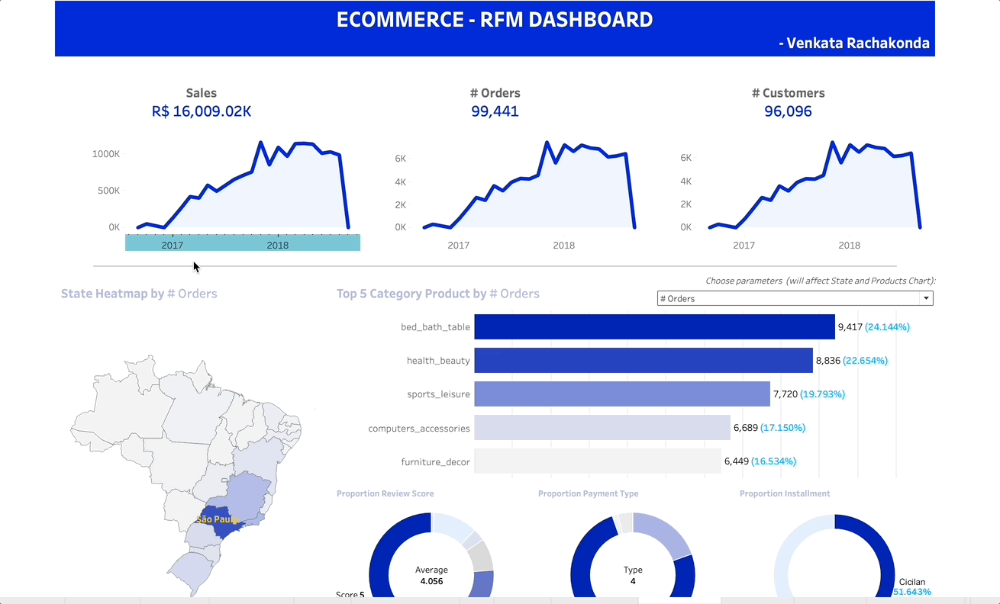

# eCommerce RFM Dashboard

## Overview
This dashboard provides a comprehensive analysis of eCommerce sales performance using RFM (Recency, Frequency, Monetary) segmentation. It allows businesses to understand customer purchase behavior by segmenting customers based on their transaction history.

## Features
- **Sales Trend Analysis**: View sales trends over time to understand growth patterns.
- **Order and Customer Metrics**: Keep track of the total number of orders and customers.
- **State Heatmap**: Visualize sales distribution across different regions.
- **Top Product Categories**: Identify the most popular product categories by the number of orders.
- **Customer Segmentation**: Segment customers based on RFM analysis for targeted marketing.

## Visualizations Included
Below are the animated GIFs providing dynamic visual insights into various aspects of eCommerce performance:

1. 
   - This time-series animated chart shows the trends in sales, the number of orders, and customer growth over time, allowing for quick identification of key trends and periods of growth or decline.

2. 
   - The retention rate graph provides a visualization of how well the business retains customers over time, which is crucial for understanding the long-term value and loyalty of the customer base.

3. 
   - This GIF illustrates the segmentation of customers based on RFM analysis. It's an effective way to visualize the distribution of customers and to identify which segments are the most valuable to the business.

